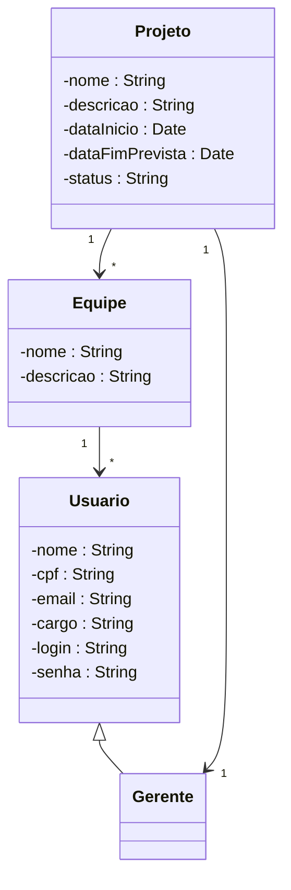

# Relatório do Projeto - Sistema de Gestão de Projetos

## 1. Objetivo
Criar um sistema para gerenciar projetos, tarefas, equipes e usuários, permitindo maior controle de prazos e eficiência no trabalho.

## 2. Arquitetura Utilizada
Foi utilizado o padrão de arquitetura **MVC (Model-View-Controller)**.

## 3. Paradigma POO
- **Encapsulamento**
- **Herança**
- **Polimorfismo**

## 4. Diagrama UML (simplificado)

## 5. Impacto Humano
O **gerente de projetos** é o principal usuário final.

## 6. Conclusão
O sistema atende às necessidades propostas e pode ser expandido futuramente com interface gráfica e relatórios visuais.
